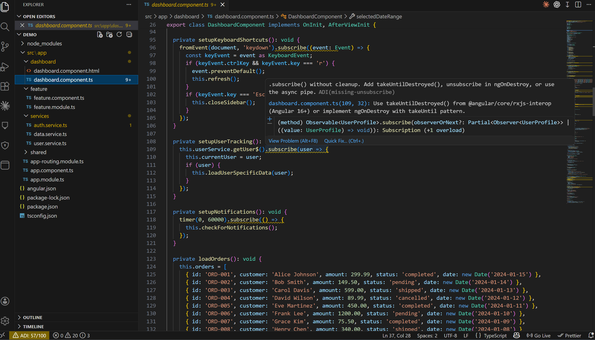
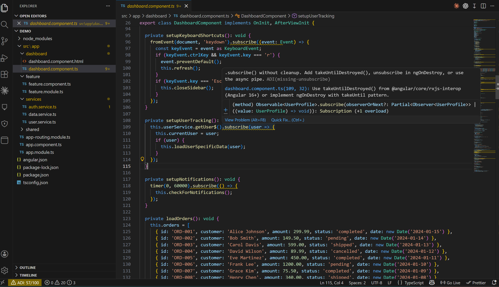
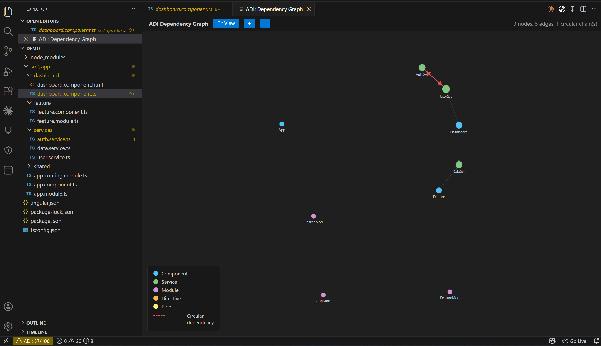
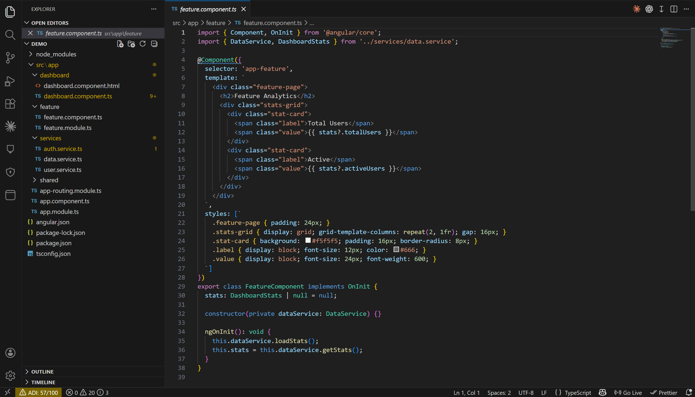
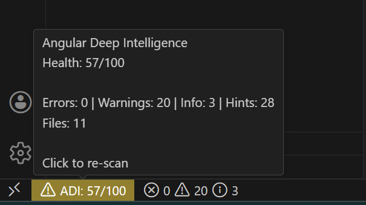

# Angular Deep Intelligence

[](https://www.typescriptlang.org/)
[](https://angular.dev/)
[](https://code.visualstudio.com/)
[](./LICENSE)
[]()

**AI-powered Angular code intelligence for VS Code.** Detects anti-patterns, migration readiness, and architecture issues using deep AST analysis with ts-morph.

Built to catch what linters miss: subscription leaks, circular dependencies, signals migration opportunities, standalone readiness scoring, and more. Integrates with your existing AI setup (Copilot, Claude, Codex) to explain issues and generate migration plans.

## Screenshots

### Inline Diagnostics
Real-time anti-pattern detection with hover tooltips explaining the issue and how to fix it.



### Quick Fix Actions
One-click fixes: add `takeUntilDestroyed()`, switch to `OnPush`, explain with AI, generate migration plans.



### Dependency Graph
Interactive D3.js force-directed graph. Circular dependencies highlighted in red.



### Project Overview
Full project scan with file-level diagnostics and health scoring.



### Status Bar
Live health score with issue breakdown. Click to re-scan.



## Features

### Anti-Pattern Detection (warnings)
- **Missing Unsubscribe** - `.subscribe()` without cleanup. Smart detection: skips HTTP calls, checks for `takeUntilDestroyed`, `DestroyRef`, `ngOnDestroy`, and async pipe in linked templates.
- **Oversized Component** - Components exceeding configurable line threshold (default: 300). Reports largest methods, constructor dependencies, and event handler count.
- **Direct DOM Manipulation** - Detects `ElementRef.nativeElement`, `document.querySelector`, `getElementById`, `createElement`, `innerHTML =`, `document.body` in components and directives.

### Performance Hints
- **Missing OnPush** - Components without `ChangeDetectionStrategy.OnPush` (leaf=info, parent=hint)
- **Template Method Calls** - `{{ method() }}`, `[prop]="method()"`, `*ngIf="method()"`, `*ngFor="let x of method()"`

### Migration Intelligence
- **Standalone Readiness** - Scores NgModule components (0-100) on standalone migration readiness. Analyzes declaration count, provider complexity, and module imports.
- **Signals Migration** - Detects RxJS patterns replaceable with Angular Signals: `BehaviorSubject` (use `signal()`), `combineLatest + map` (use `computed()`), private `Subject` for local state, `.getValue()` code smell.

### Architecture Analysis
- **Circular Service Dependencies** - Detects circular chains between services via DFS graph traversal. Reports the full cycle path.
- **Lazy Loading Opportunities** - Finds eagerly-loaded routes and feature modules that could use `loadComponent`/`loadChildren`.
- **Shared Module Bloat** - Flags SharedModules with too many declarations (>15), exports (>15), or excessive third-party re-exports.

### AI-Powered Insights
- **Explain with AI** - Click the lightbulb on any diagnostic for an AI explanation: summary, why it matters, how to fix, and a code example.
- **Generate Migration Plan** - Step-by-step migration plans with effort estimate and risk assessment for standalone and signals migrations.
- **Provider-agnostic** - Uses your existing VS Code AI (Copilot, Claude, Codex, Cline, Roo Code, Continue, Cody, Amazon Q, CodeGPT, Gemini). Falls back to direct Claude API if no chat models are available.
- **Response caching** - 24-hour cache to avoid redundant API calls.

### Dependency Graph Visualization
- Interactive D3.js force-directed graph in a VS Code webview panel
- Nodes colored by type: components (blue), services (green), modules (purple), directives (orange), pipes (yellow)
- Node size scales with connection count
- Circular dependencies highlighted in red with dashed edges
- Zoom, pan, drag, fit-to-viewport, double-click to open source file

### Health Dashboard
- Activity bar panel with real-time health score (0-100)
- Project stats and issues grouped by category
- Per-rule breakdown with occurrence counts
- Click any finding to jump to the exact file and line
- Color-coded status bar: green (>= 80), orange (>= 50), red (< 50)

### Developer Experience
- **Incremental analysis** - file watcher re-analyzes on save, content hash caching skips unchanged files
- **Quick fixes** - lightbulb actions for `takeUntilDestroyed()`, `OnPush`, split suggestions, AI explanations
- **Configurable** - enable/disable individual rules, set thresholds

## Rules (10 total)

| Rule | Severity | Category | Detects |
|------|----------|----------|---------|
| missing-unsubscribe | warning | anti-pattern | `.subscribe()` without cleanup |
| oversized-component | warning | anti-pattern | Components > 300 lines |
| direct-dom-manipulation | warning | anti-pattern | nativeElement, querySelector, innerHTML |
| circular-service-deps | warning | architecture | Circular dependency chains |
| missing-onpush | info/hint | performance | Components without OnPush |
| template-method-calls | hint | performance | Method calls in templates |
| lazy-loading-opportunities | hint | performance | Eagerly loaded routes/modules |
| standalone-readiness | hint | migration | NgModule standalone migration score |
| signals-migration | hint | migration | RxJS patterns replaceable with Signals |
| shared-module-bloat | hint | architecture | Bloated SharedModules |

## Severity Philosophy

Health score reflects **real problems**, not suggestions:
- **Errors** (5.0 weight) - Critical issues that will cause bugs
- **Warnings** (1.0 weight) - Anti-patterns that should be fixed
- **Info** (0.05 weight) - Useful observations, barely affect score
- **Hints** (0 weight) - Pure suggestions, zero score impact

## Architecture

```
Workspace Files
    |
    v
WorkspaceScanner (vscode.workspace.fs + ts-morph AST)
    |
    v
ProjectIndex { files, fileMap, stats }
    |
    v
AnalyzerRegistry.runAll() -> AnalysisDiagnostic[]
    |
    +-> DiagnosticCollection (editor squiggly lines)
    +-> TreeView (health dashboard panel)
    +-> StatusBar (health score 0-100)
    +-> CodeActions (quick fixes + AI actions)
    +-> FileCache (content hash, skip unchanged)
    +-> AiProvider (VS Code LM / Claude API)
```

## Try It Yourself

The repo includes a `demo/` project - a small Angular app with intentional anti-patterns that trigger all 10 rules. Use it to see the extension in action without needing your own Angular project.

```bash
# 1. Clone and install
git clone https://github.com/OsamaHassouna/angular-deep-intelligence.git
cd angular-deep-intelligence
npm install

# 2. Open the demo project in the Extension Development Host
#    Press F5 in VS Code, then open the demo/ folder

# 3. Run the scan
#    Command Palette > "ADI: Scan Project"
```

## Usage

1. Open an Angular project in VS Code
2. Run command: `ADI: Scan Project` (or click the status bar item)
3. See diagnostics (squiggly lines) on files with issues
4. Open the ADI panel in the activity bar for the health dashboard
5. Use Quick Fix actions (lightbulb) for automated remediation
6. Edit and save files - diagnostics update automatically

## Development

```bash
npm install
npm run compile
# Press F5 in VS Code to launch Extension Development Host
```

## Built With

- **[ts-morph](https://ts-morph.com/)** - TypeScript AST analysis (not regex-based linting)
- **[VS Code Extension API](https://code.visualstudio.com/api)** - Diagnostics, CodeActions, TreeView, Webview, StatusBar
- **[VS Code Language Model API](https://code.visualstudio.com/api/extension-guides/language-model)** - AI provider abstraction
- **[D3.js](https://d3js.org/)** - Force-directed dependency graph visualization
- **[Mocha](https://mochajs.org/) + [@vscode/test-electron](https://github.com/nicedoc/vscode-test)** - 84+ tests (unit + integration)

## License

[MIT](./LICENSE)
